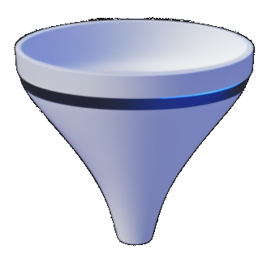

# @use-funnel

<div align="center">
  <a href="https://use-funnel.slash.page" title="@use-funnel - A powerful and safe step-by-step state management library">
    
    <h1 align="center">@use-funnel</h1>
  </a>
  <p style="font-size:18px;">A powerful and safe step-by-step state management library</p>
</div>

`@use-funnel` is a [React Hook](https://react.dev/reference/rules/rules-of-hooks) that helps you easily implement complex UI flows.

## Core Concepts

### Strong Type Support

By comparing the type of the current step with the type of the next step, you can safely manage only the necessary states.

### State Management by History

Manage states by history, so you can easily manage back and forth.

### Various Router Support

Supports browser history, react-router-dom, next.js, @react-navigation/native, etc.

## Example

```tsx
import { useFunnel } from '@use-funnel/react-router-dom';

export function App() {
  const funnel = useFunnel<{
    Step1: { message?: string; flag?: boolean };
    Step2: { message: string; flag?: boolean };
    Step3: { message: string; flag: boolean };
  }>({
    id: 'hello-world',
    initial: {
      step: 'Step1',
      context: {},
    },
  });
  return (
    <funnel.Render
      Step1={({ history }) => <Step1 onNext={(message) => history.push('Step2', { message })} />}
      Step2={({ context, history }) => (
        <Step2 message={context.message} onNext={(flag) => history.push('Step3', { flag })} />
      )}
      Step3={({ context }) => <Step3 message={context.message} flag={context.flag} />}
    />
  );
}

declare function Step1(props: { onNext: (message: string) => void }): React.ReactNode;
declare function Step2(props: { message: string; onNext: (flag: boolean) => void }): React.ReactNode;
declare function Step3(props: { message: string; flag: boolean }): React.ReactNode;
```

## Visit [use-funnel.slash.page](https://use-funnel.slash.page) for docs, guides, API and more!

[English](https://use-funnel.slash.page/en) | [한국어](https://use-funnel.slash.page/ko)

## Contributing

Read our [Contributing Guide](./CONTRIBUTING.md) to familiarize yourself with `@use-funnel` development process, how to suggest bug fixes and improvements, and the steps for building and testing your changes.

<a title="Toss" href="https://toss.im">
  <picture>
    <source media="(prefers-color-scheme: dark)" srcset="https://static.toss.im/logos/png/4x/logo-toss-reverse.png">
    
  </picture>
</a>

MIT © Viva Republica, Inc. See [LICENSE](./LICENSE) for details.
