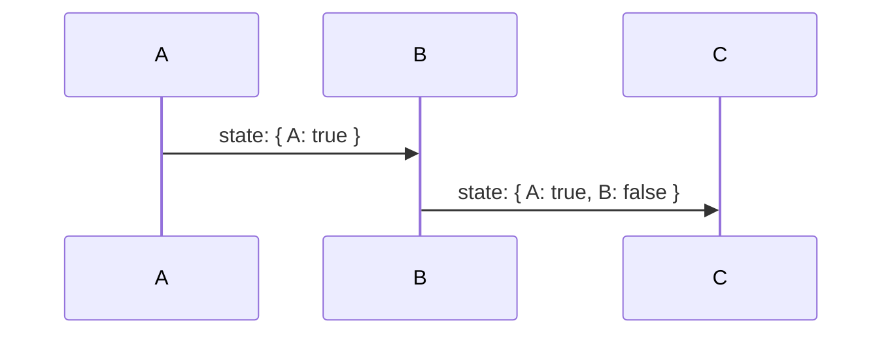
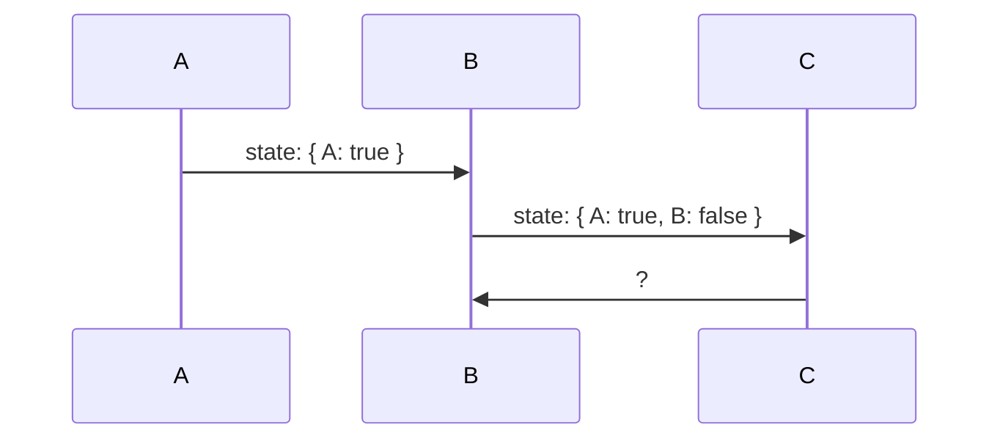
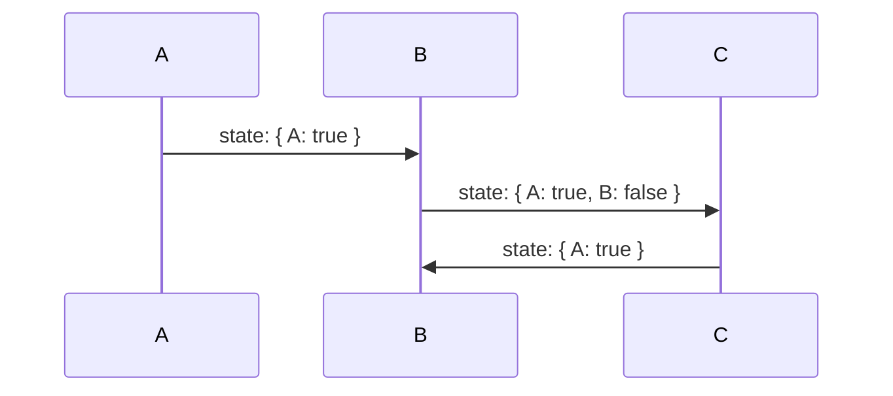

import { Keyword, KeywordDescription } from '@/components';

# Key Features

## Overview

`@use-funnel` helps manage the state of each <Keyword>step</Keyword> safely with strong type support and maintains consistent history state, ensuring the user has the correct state at each step.

## Managing UI State with Strong Type Safety

When developing a UI composed of multiple steps, it's important to manage the state of each step. `@use-funnel` allows you to define and manage the state of each step with type safety.

### Issues Implementing Complex UI Flows Without `@use-funnel`

Without `@use-funnel`, managing the state of a multi-step UI can become complex.

```tsx
type Funnel =
  | { step: "A"; context: { a: string; b?: string; c?: string; } }
  | { step: "B"; context: { a: string; b: string; c?: string; } }
  | { step: "C"; context: { a: string; b: string; c: string; } };

const [funnel, setFunnel] = useState<Funnel>({ step: "A", context: { a: "a" } });
```

But, this approach has several issues:

```tsx
// When transitioning from A to B, only `b` should be required, but `a` is also required.
setFunnel({ step: "B", context: { b: "new b" } }) // compile error
setFunnel({ step: "B", context: { a: funnel.context.a, b: "new b" } }) // no compile error
```

- **Complex History Management**: You need to implement history operations like going back and forward separately.
- **Difficulty in State Transitions**: It's challenging to filter out only the required states when transitioning between steps. For example, when transitioning from step A to B, only `b` should be required, but in a typical implementation, `a` might also be required.

## Easy Management with `@use-funnel`

The following code demonstrates defining two steps, A and B, using `useFunnel`.

- Each step has its unique <Keyword>context</Keyword>.
- The initial <Keyword>step</Keyword> is A, where the type of `context.a` is `string` or `undefined`.
- When the <Keyword>step</Keyword> changes to B, the type of `context.a` is fixed as `string`.

```tsx
const funnel = useFunnel<{
  A: { a?: string; b?: string };
  B: { a: string; b?: string };
}>({
  id: "strongly-typed",
  initial: {
    step: "A",
    context: {}
  }
});

// When the initial step is "A", the type of context.a is "string" or "undefined"
funnel.step === "A" && typeof funnel.context.a // "string" | "undefined"
// When the step changes to "B", the type of context.a is "string"
funnel.step === "B" && typeof funnel.context.a // "string"
```

Ensuring type safety for the <Keyword>context</Keyword> property of each <Keyword>step</Keyword> guarantees that you can clearly define the required <Keyword>context</Keyword> and prevent errors.

---

Next is an example of code that throws an error because it doesn't match the defined type.

```tsx {3,15}
const funnel = useFunnel<{
  A: { a?: string; b?: string; c?: string };
  B: { a: string; b: string; c?: string };
  C: { a: string; b: string; c: string };
}>({
  id: "strongly-typed",
  initial: {
    step: "A",
    context: { a: "a" }
  }
});

if (funnel.step === "A") {
	funnel.history.push("B", {});
	// ^ '{}' is not assignable to type '{ a: string; b: string; c?: string; }'.
}
```

{/* 이 코드에서 에러가 발생하는 이유는 빈 객체 `{}`를 사용해서 `B` <Keyword>step</Keyword>으로 전환하려고 시도하기 때문이에요. B <Keyword>step</Keyword>의 타입 정의에 따르면, `b`는 필수로 값이 필요한 프로퍼티에요. 빈 객체는 이러한 타입 정의와 다르기 때문에 에러가 발생합니다.
 */}
The error occurs because you are trying to transition to the `B` step using an empty object `{}`. According to the type definition of the `B` step, `b` is a required property. Since an empty object does not match this type definition, an error occurs.

To resolve the error, you need to provide the required property `b` value when transitioning to the `B` step. For example, you can modify the code as follows:

```tsx
if (funnel.step === "A") {
    funnel.history.push("B", { b: "required value" });
}
```

Now that the type definition is satisfied, the error no longer occurs.

## Easy History State Management

Managing history state is crucial for implementing complex UI flows. `@use-funnel` manages state and history together, storing state snapshots and updating the current state based on route changes.

### History Management

With `@use-funnel`, you can easily manage the history of state transitions. This ensures that navigating back and forth between steps maintains the correct state.

Let's consider a simple funnel with three steps: A → B → C.



After selecting `true` in step A and `false` in step B, you move to step C. If the user navigates back from step C, what should the state be?



Ideally, you would expect the state to return to the state selected in step B: `state: { A: true, B: false }`. However, if the state is separated from the history, navigating back may not restore the state correctly, and only the latest state may be maintained.



`@use-funnel` solves this problem by managing <Keyword>history</Keyword> and state together. Each time the funnel transitions to the next step, it saves a state snapshot in the history. When the route changes, the current state is updated accordingly.

If necessary, you can customize the router to update the state directly in local storage or on the server. For more information, see the [Custom Router](/docs/custom-router) documentation.