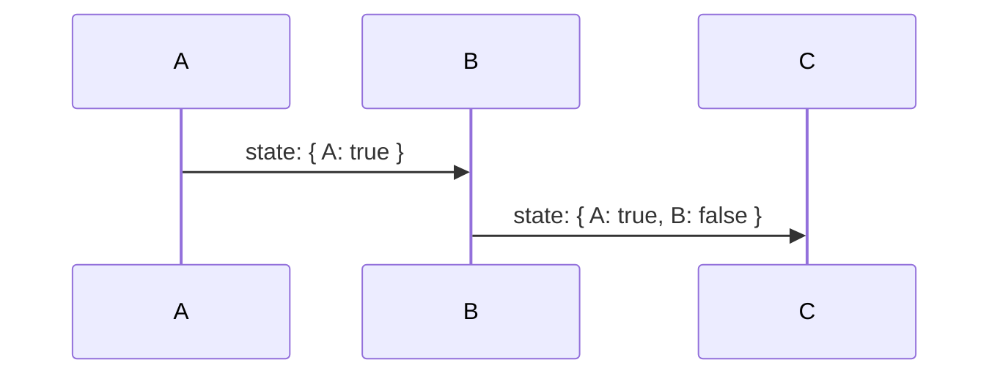
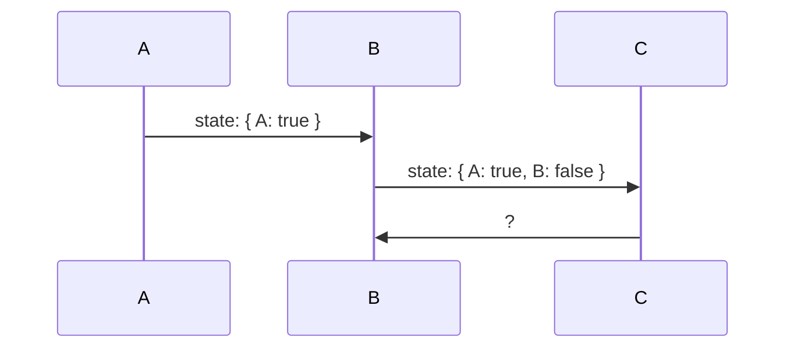
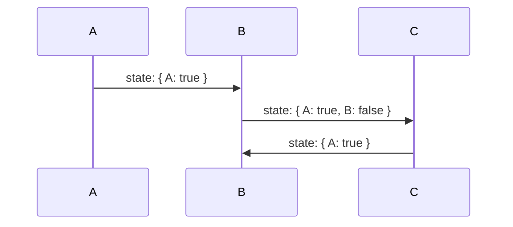

import { Keyword, KeywordDescription } from '@/components';

# 주요 기능

`@use-funnel`은 강력한 타입 지원 덕분에 각 <Keyword>step</Keyword>의 상태를 안전하게 관리하고, 히스토리 상태를 일관되게 유지하여 사용자가 단계별로 정확한 상태를 유지할 수 있도록 도와줘요.

## 강력한 타입 안전성으로 관리하는 UI 상태

여러 단계로 구성된 UI를 개발할 때 각 단계의 상태를 관리하는 것은 중요해요. `@use-funnel`을 사용하면 각 단계의 상태를 타입으로 정의하고 안전하게 관리할 수 있어요.

### @use-funnel 없이 복잡한 UI 흐름을 구현할 때의 문제점

`@use-funnel` 없이 여러 <Keyword>step</Keyword>으로 구성된 UI를 개발하려면 각 단계의 상태를 관리하는 것이 복잡해질 수 있어요. 다음 예제 코드를 살펴보세요.

```tsx
type Funnel =
  | { step: "A"; context: { a: string; b?: string; c?: string; } }
  | { step: "B"; context: { a: string; b: string; c?: string; } }
  | { step: "C"; context: { a: string; b: string; c: string; } };

const [funnel, setFunnel] = useState<Funnel>({ step: "A", context: { a: "a" } });
```

하지만 이렇게 개발하면 다음과 같은 문제가 생겨요.

```tsx
// A에서 B로 전환할 때 b만 필수로 요구되어야 하는데, a도 필수로 요구됩니다.
setFunnel({ step: "B", context: { b: "new b" } }) // compile error
setFunnel({ step: "B", context: { a: funnel.context.a, b: "new b" } }) // no compile error
```

- 히스토리 관리의 복잡성: 뒤로 가기, 앞으로 가기와 같은 <Keyword>history</Keyword> 조작을 따로 구현해야 해요.
- 상태 전환의 어려움: <Keyword>step</Keyword>을 전환할 때 필수적으로 요구되는 상태만 정확하게 추릴 수 없어요. 예를 들어 A 단계에서 B 단계로 전환할 때 필수 값은 `b` 뿐이지만, 일반적인 구현에서는 `a`도 필수로 요구될 수 있어요.

### @use-funnel을 사용해서 쉽게 관리하기

다음 코드는 `useFunnel`를 사용해서 두 가지 <Keyword>step</Keyword> A와 B를 정의하는 예제에요. 

- 각 단계는 고유한 <Keyword>context</Keyword>를 가지고 있어요. 
- 초기 <Keyword>step</Keyword>은 A이고, 이 <Keyword>step</Keyword>에서 `context.a`의 타입은 `string` 이거나 `undefined`에요.
- <Keyword>step</Keyword>이 B로 변경되면 `context.a`의 타입은 `string`으로 고정돼요.

```tsx
const funnel = useFunnel<{
  A: { a?: string; b?: string };
  B: { a: string; b?: string };
}>({
  id: "strongly-typed",
  initial: {
    step: "A",
    context: {}
  }
});

// 초기 단계가 "A"일 때, context의 a 타입은 "string" 또는 "undefined"
funnel.step === "A" && typeof funnel.context.a // "string" | "undefined"
// 단계가 "B"로 변경되면, context의 a 타입은 "string"
funnel.step === "B" && typeof funnel.context.a // "string"
```

이렇게 <Keyword>step</Keyword>마다 <Keyword>context</Keyword> 프로퍼티의 타입 안전성을 보장하면, 필요한 <Keyword>context</Keyword>를 명확하게 정의하고 오류를 방지할 수 있어요.

---

다음 예제는 정의된 타입에 맞지 않아 오류가 나는 코드에요.

<div className="code-highlight nx-mt-6 first:nx-mt-0">

```tsx {3,15}
const funnel = useFunnel<{
  A: { a: string; b?: string; c?: string };
  B: { a: string; b: string; c?: string };
}>({
  id: "strongly-typed",
  initial: {
    step: "A",
    context: {
      a: "Hello"
    }
  }
});

if (funnel.step === "A") {
	funnel.history.push("B", {});
	// ^ '{}' 형식의 인수는 '{ b: string; a?: string | undefined; c?: string | undefined; }' 형식의 매개 변수에 할당될 수 없습니다.
}
```

</div>

이 코드에서 에러가 발생하는 이유는 빈 객체 `{}`를 사용해서 `B` <Keyword>step</Keyword>으로 전환하려고 시도하기 때문이에요. B <Keyword>step</Keyword>의 타입 정의에 따르면, `b`는 필수로 값이 필요한 프로퍼티에요. 빈 객체는 이러한 타입 정의와 다르기 때문에 에러가 발생합니다.

에러를 해결하려면 B <Keyword>step</Keyword>으로 전환할 때 필수 프로퍼티 `b` 값을 제공해야 해요. 예를 들어 다음과 같이 수정할 수 있어요.

```tsx
if (funnel.step === "A") {
    funnel.history.push("B", { b: "required value" });
}
```

이제 타입 정의를 만족해서 에러가 발생하지 않아요.

## 쉬운 히스토리 상태 관리

히스토리 상태를 관리하는 것은 복잡한 UI 흐름을 구현할 때 매우 중요해요. 사용자가 단계별로 이동하면서 정확한 상태를 유지할 수 있어야 하기 때문이죠. 여기서 `@use-funnel`이 어떻게 도움이 되는지 살펴볼게요.

세 가지 <Keyword>step</Keyword> A → B → C로 진행되는 간단한 퍼널을 예로 들어 설명해볼게요.



A <Keyword>step</Keyword>에서 `true`를 선택하고 B <Keyword>step</Keyword>에서 `false`를 선택한 후 C <Keyword>step</Keyword>로 넘어갑니다. 이제 C <Keyword>step</Keyword>에서 사용자가 뒤로 가기를 한다면 상태는 어떻게 될까요?



일반적으로는 B 단계에서 선택한 상태 `state: { A: true, B: false }`로 돌아갈 거라고 기대하죠. 하지만 상태가 히스토리와 분리되어 있다면, 뒤로 가기를 했을 때 상태가 제대로 복원되지 않고 최신 상태만 유지될 수 있어요.



`@use-funnel`은 이런 문제를 해결하기 위해 히스토리와 상태를 함께 관리해요. 퍼널이 다음 단계로 넘어갈 때마다 <Keyword>history</Keyword>에 상태 스냅샷을 저장하고, 라우트 변경에 따라 현재 상태를 업데이트하는 방법을 사용하죠.

필요하다면 직접 라우터를 구현해 로컬 스토리지나 서버에 상태를 바로 업데이트하도록 커스터마이즈할 수도 있어요. 자세한 방법은 [라우터 직접 만들기](/docs/custom-router) 문서에서 확인할 수 있어요.
