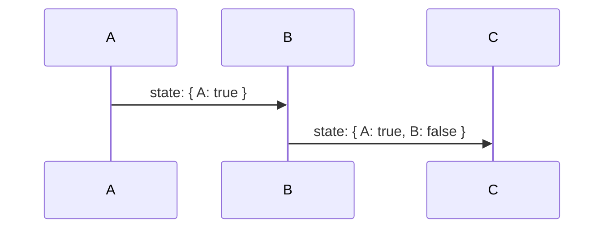
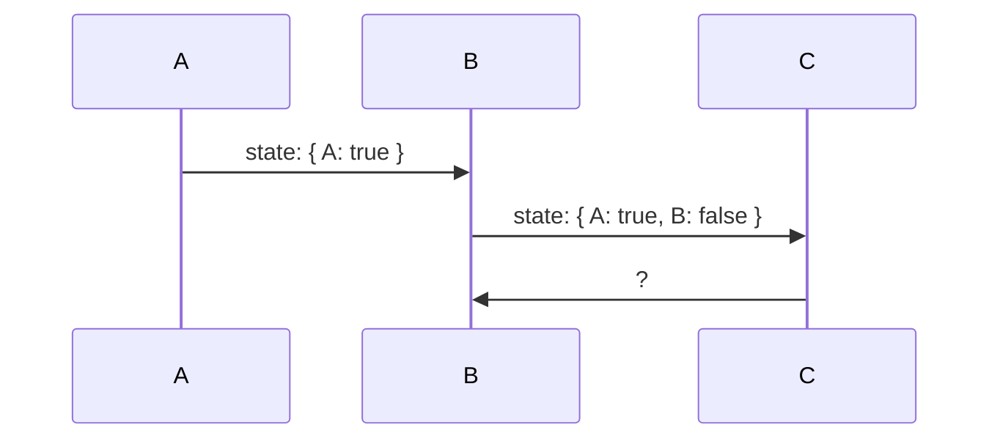
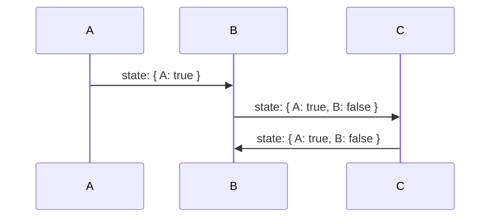
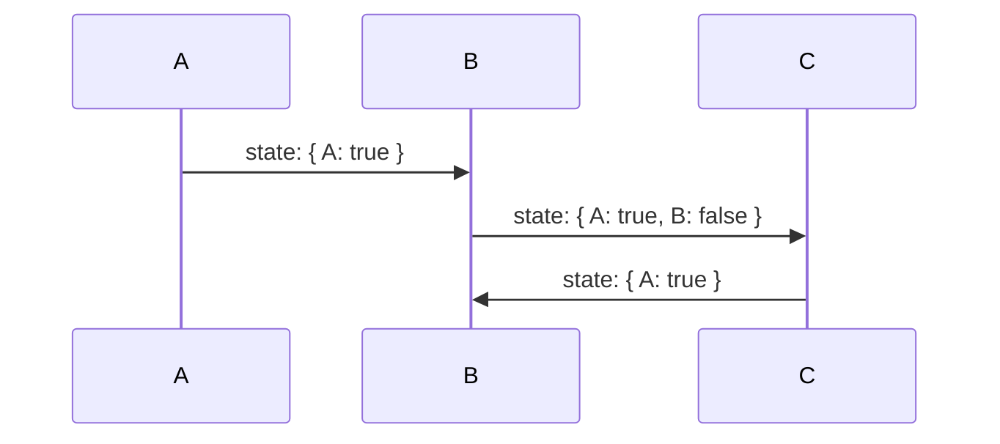

import { Keyword, KeywordDescription } from '@/components';

# 소개글

<video src="/example.mp4" width={250} muted autoPlay loop className="float-right ml-6 my-6" />

`@use-funnel`은 복잡한 UI 흐름을 간편하게 구현할 수 있도록 도와주는 React 훅이에요.

각 단계의 상태를 명확하게 정의하고, 이를 통해 유연하고 견고한 퍼널 방식의 UI 패턴을 쉽게 구현할 수 있어요. `@use-funnel`은 각 단계별 상태와 히스토리를 Type Safe하게 관리할 수 있게 해주며, 복잡한 UI 단계를 체계적으로 구성할 수 있게 도와줘요.

`@use-funnel`은 강력한 타입 지원, 일관된 상태 관리와 함께 다양한 라우터 라이브러리와 결합 가능한 유연한 API를 제공해요.

## 용어설명

들어가기 앞서 이 문서에서 전체적으로 사용하는 용어에 대해서 설명해드릴게요.

* <Keyword keyword="step" /> : <KeywordDescription keyword="step" />
* <Keyword keyword="context" /> : <KeywordDescription keyword="context" />
* <Keyword keyword="history" /> : <KeywordDescription keyword="history" />


## 왜 만들었나요?

```tsx
type Funnel =
  | { step: "A"; context: { a: string; b?: string; c?: string; } }
  | { step: "B"; context: { a: string; b: string; c?: string; } }
  | { step: "C"; context: { a: string; b: string; c: string; } };

const [funnel, setFunnel] = useState<Funnel>({ step: "A", context: { a: "a" } });
```

`@use-funnel` 없이 <Keyword keyword="step" /> 별로 상태가 확장되는 개발할 때, 위와 같은 union type을 정의해서 개발 할 수 있습니다. 하지만 다음과 같은 문제점이 있어요.

- 뒤로가기, 앞으로가기와 같은 <Keyword keyword="history" /> 조작을 따로 구현해야해요.
- <Keyword keyword="step" /> 을 전환할 때 현재 <Keyword keyword="step" /> 와 비교해서 필수적으로 요구되는 상태만을 추릴 수 없어요.
    - 예를 들어, 위에 `{ step: "A" }{:ts}` 과 `{ step: "B" }{:ts}`의 타입 집합에서 프로퍼티 `b` 만 필수지만, 일반적으로 구현할 경우 `a` 도 필수로 요구되어야 해요.
    <div className="code-highlight-error nx-mt-6 first:nx-mt-0">
    ```tsx /{ b: "new b" }/
    // A에서 B로 전환할 때 b만 필수로 요구되어야 하는데, a도 필수로 요구됩니다.
    setFunnel({ step: "B", context: { b: "new b" } }) // compile error
    setFunnel({ step: "B", context: { a: funnel.context.a, b: "new b" } }) // no compile error
    ```
    </div>

`@use-funnel`은 이러한 문제점을 해결하기 위해 만들어졌어요.

## 왜 사용하나요?

### 강력한 타입 지원

```tsx /funnel/
const funnel = useFunnel<{
  A: { a?: string; b?: string };
  B: { a: string; b?: string };
}>({
  id: "strongly-typed",
  initial: {
    step: "A",
    context: {}
  }
});

funnel.step === "A" && typeof funnel.context.a // "string" | "undefined"
funnel.step === "B" && typeof funnel.context.a // "string"
```

하나의 컴포넌트에서 여러 <Keyword keyword="step" /> 을 개발하고자할때 각 <Keyword keyword="step" /> 의 상태를 타입으로 정의해서 사용하고, 이를 통해 각 <Keyword keyword="step" /> 에서의 <Keyword keyword="context" /> 의 타입을 알 수 있어요.

<div className="code-highlight-error nx-mt-6 first:nx-mt-0">

```tsx {15}
const funnel = useFunnel<{
  A: { a: string; b?: string; c?: string };
  B: { a: string; b: string; c?: string };
}>({
  id: "strongly-typed",
  initial: {
    step: "A",
    context: {
      a: "Hello"
    }
  }
});

if (funnel.step === "A") {
	funnel.history.push("B", {});
	// ^ '{}' 형식의 인수는 '{ b: string; a?: string | undefined; c?: string | undefined; }' 형식의 매개 변수에 할당될 수 없습니다.
}
```

</div>

<Keyword keyword="step" /> 을 전환할 때 필수적으로 요구되는  <Keyword keyword="context" /> 들을 알 수 있어요. 예를 들어 위에 A 단계와 B 단계의 타입 집합에서 프로퍼티 `b`만 차이점으로 optional 하지 않게 되어 전환할 때 `b`만 필수로 요구하게돼요.

### 히스토리 상태를 한 번에 관리

A → B → C로 진행되는 간단한 퍼널이 있다고 가정해볼게요.



A단계에서 `true`를 선택하고 B단계에서 `false`를 선택한 후 C단계로 넘어갔어요.



이때 C단계에서 뒤로가기를 한다면 상태가 어떻게 변할까요?



일반적으로는 이전에 B단계에 진입했을 당시의 상태인 `state: { A: true }{:ts}` 를 기대하겠지만, 상태가 히스토리와 분리되어있는 경우 뒤로가기에 대해서 별도의 처리를 해주지 않으면 상태는 이전 상태로 돌아가지 않고 최신상태를 유지해요.



`@use-funnel` 은 이런 문제를 해결하기 위해 history와 state를 함께 관리해요. 좀 더 자세히는 내부적으로 <Keyword keyword="history" /> 에 퍼널이 다음 <Keyword keyword="step" /> 으로 넘어가는 시점의 상태 스냅샷을 모두 저장해두고 라우트 변경에 따라 현재 상태를 업데이트해요. 

필요한 경우 router를 직접 구현해 localStorage나 서버 등에 상태를 바로 업데이트 하도록 커스텀 할 수 있어요. 자세한 방법은 [여기](/docs/custom-router)에서 확인할 수 있어요.
