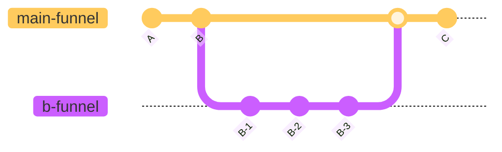

import { UseFunnelCodeBlock, Keyword, Sandpack } from '@/components'

# Create funnel inside funnel

When developing a funnel, there are times when you need to go through multiple steps to create a single state. Or you may need to reuse a part of the funnel steps elsewhere. In such cases, dividing the funnel into sub-funnels can be efficient. The flowchart looks like this:



`@use-funnel` supports sub-funnels. Simply specify a different `id` when using [`useFunnel()`](./use-funnel.mdx) in the components under the <Keyword>step</Keyword>.


<div className='h-8' />
<Sandpack>

```tsx Example.tsx active
import { useFunnel } from "@use-funnel/react-router-dom";

import { BFunnel } from "./BFunnel";

export function Example() {
  const funnel = useFunnel<{
    A: { a?: string; b?: string; };
    B: { a: string; b?: string; };
    C: { a: string; b: string; };
  }>({
    id: "main-funnel",
    initial: {
      step: "A",
      context: {}
    }
  });
  return (
    <funnel.Render
      A={({ history }) => (
        <div>
          <h1>A Step</h1>
          <button onClick={() => history.push('B', { a: 'a' })}>Next</button>
        </div>
      )}
      B={({ context, history }) => (
        <div>
          <h1>B Step</h1>
          <BFunnel a={context.a} onNext={b => history.push('C', { b })} />
        </div>
      )}
      C={({ context }) => (
        <div>
          <h1>C Step</h1>
          <p>a: {context.a}</p>
          <p>b: {context.b}</p>
        </div>
      )}
    />
  )
}
```

```tsx BFunnel.tsx
import { useFunnel } from "@use-funnel/react-router-dom";

interface Props {
  a: string;
  onNext: (b: string) => void;
}

export function BFunnel({ a, onNext }: Props) {
  const funnel = useFunnel<{
    B1: { hello?: string; world?: string;};
    B2: { hello: string; world?: string; };
    B3: { hello: string; world: string; };
  }>({
    id: "b-funnel",
    initial: {
      step: "B1",
      context: {}
    }
  });
  return (
    <funnel.Render
      B1={({ history }) => (
        <div>
          <h2>B1 Step</h2>
          <p>before a value: {a}</p>
          <button onClick={() => history.push('B2', { hello: 'Hello' })}>Next</button>
        </div>
      )}
      B2={({ context, history }) => (
        <div>
          <h2>B2 Step</h2>
          <p>before a value: {a}</p>
          <p>before hello value: {context.hello}</p>
          <button onClick={() => history.push('B3', { world: 'World' })}>Next</button>
        </div>
      )}
      B3={({ context }) => (
        <div>
          <h2>B3 Step</h2>
          <p>before a value: {a}</p>
          <p>before hello value: {context.hello}</p>
          <p>before world value: {context.world}</p>
          <button onClick={() => onNext(`${context.hello} ${context.world} from BFunnel`)}>Next</button>
        </div>
      )}
    />
  )
}
```

</Sandpack>
