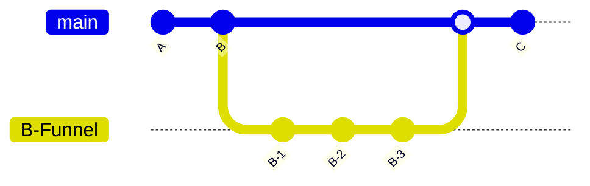

퍼널을 개발하다보면 하나의 상태를 만들기 위해서 내부적으로 여러 단계를 거쳐야할 때가 있습니다. 혹은 일정 부분의 퍼널 단계를 다른 곳에서 재활용해야할 때가 있습니다.

이 경우 퍼널을 서브 퍼널로 나누어 개발하면 효율적입니다.

```tsx
import { useFunnel } from "@use-funnel/next";

function useMainFunnel() {
  return useFunnel<{
    A: {};
    B: {};
    C: {};
  }>({
    id: "main-funnel",
    initial: {
      step: "A",
      context: {}
    }
  });
}

function useBFunnel() {
  return useFunnel<{
    B1: {};
    B2: {};
    B3: {};
  }>({
    id: "b-funnel",
    initial: {
      step: "B1",
      context: {}
    }
  });
}
```

`@use-funnel` 은 서브 퍼널을 지원합니다. 간단하게 `useFunnel()` 을 사용할 때 다른 id를 지정하면 됩니다.