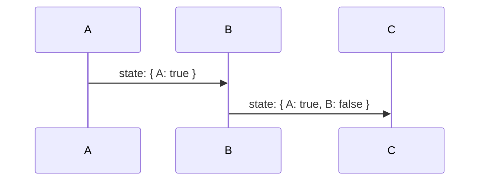
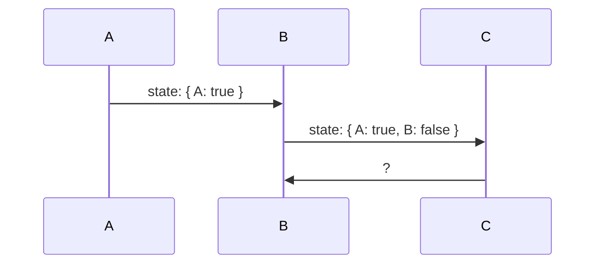
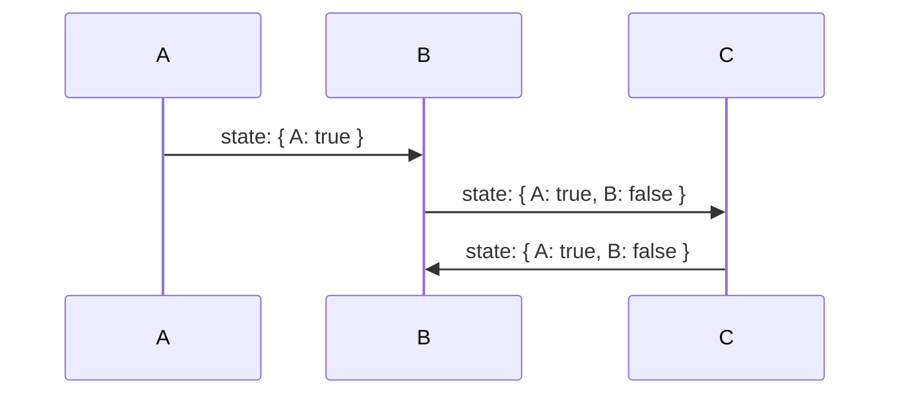
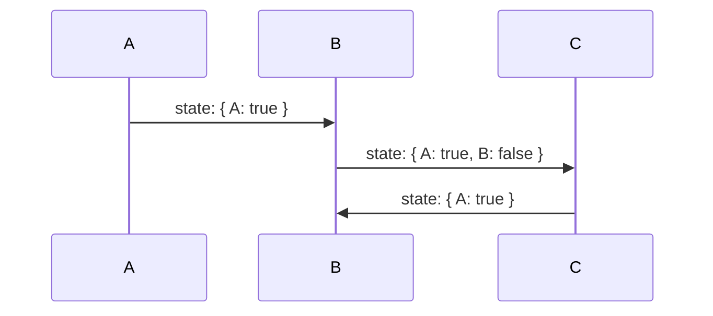

# 왜 사용하나요?

## 강력한 타입 지원

```tsx /funnel/
const funnel = useFunnel<{
  A: { a?: string; b?: string };
  B: { a: string; b?: string };
}>({
  id: "strongly-typed",
  initial: {
    step: "A",
    context: {}
  }
});

funnel.step === "A" && typeof funnel.context.a // "string" | "undefined"
funnel.step === "B" && typeof funnel.context.a // "string"
```

하나의 컴포넌트에서 여러 단계를 개발하고자할때 각 단계의 상태를 타입으로 정의해서 사용하고, 이를 통해 각 단계에서의 상태의 타입을 알 수 있습니다.

```tsx /funnel/
const funnel = useFunnel<{
  A: { a: string; b?: string; c?: string };
  B: { a: string; b: string; c?: string };
}>({
  id: "strongly-typed",
  initial: {
    step: "A",
    context: {
      a: "Hello"
    }
  }
});

if (funnel.step === "A") {
	funnel.history.push("B", {});
	// ^ '{}' 형식의 인수는 '{ b: string; a?: string | undefined; c?: string | undefined; }' 형식의 매개 변수에 할당될 수 없습니다.
}
```

단계를 전환할 때 필수적으로 요구되는 상태들을 알 수 있습니다. 예를 들어 위에 A 단계와 B 단계의 타입 집합에서 프로퍼티 b만 차이점으로 optional 하지 않게 되어 전환할 때 b만 필수로 요구하게 됩니다.

## history-state를 한 번에 관리

A → B → C로 진행되는 간단한 퍼널이 있다고 가정해봅시다. 



A단계에서 `true`를 선택하고 B단계에서 `false`를 선택한 후 C단계로 넘어갔습니다.



이때 C단계에서 뒤로가기를 한다면 상태가 어떻게 변할까요?



일반적으로는 이전에 B단계에 진입했을 당시의 상태인 `state:{ A: true }` 를 기대하겠지만, 상태가 history와 분리되어있는 경우 뒤로가기에 대해서 별도의 처리를 해주지 않으면 상태는 이전 상태로 돌아가지 않고 최신상태를 유지합니다.



`@use-funnel` 은 이런 문제를 해결하기 위해 history와 state를 함께 관리합니다. 좀 더 자세히 내부적으로 history에 퍼널이 다음 단계로 넘어가는 시점의 상태 스냅샷을 모두 저장해두고 라우트 변경에 따라 현재 상태를 업데이트합니다. 

```tsx
interface UseFunnelRouter {
  history: State[];
  currentIndex: number;
  push: (state: State) => void;
  replace: (state: State) => void;
}
```

필요한 경우 router를 직접 구현해 localStorage나 서버 등에 상태를 바로 업데이트 하도록 커스텀 할 수 있습니다. 자세한 방법은 [여기](https://www.notion.so/WIP-use-funnel-8b684b0891fe4cee98358a7abe8a7ed1?pvs=21)에서 확인하세요.
